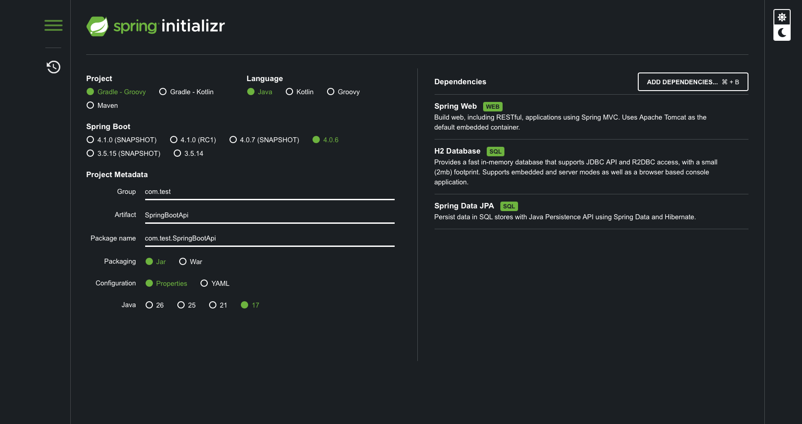
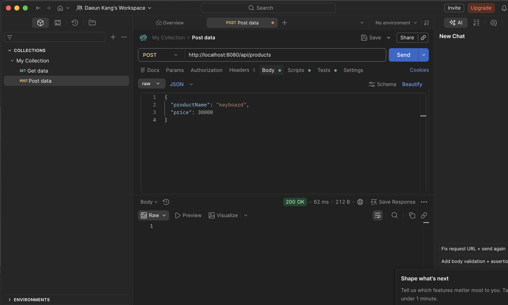
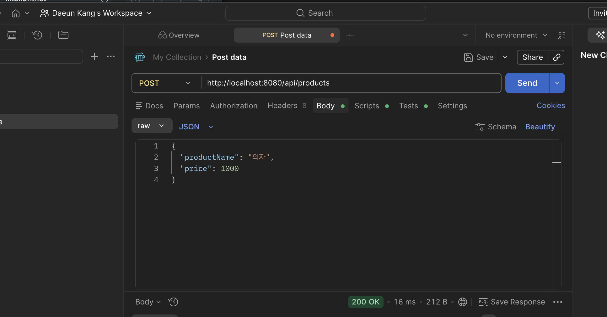
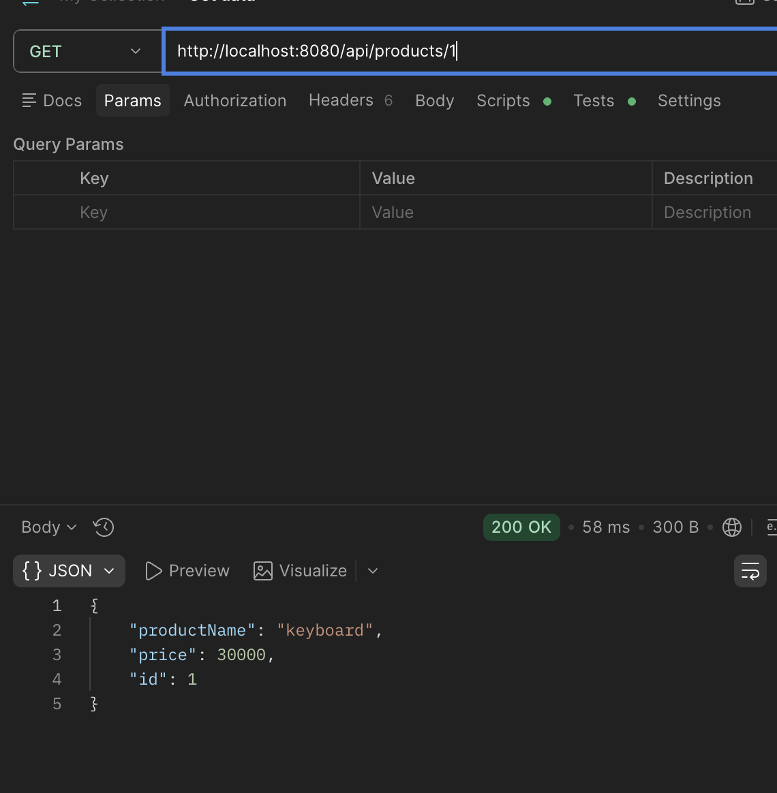
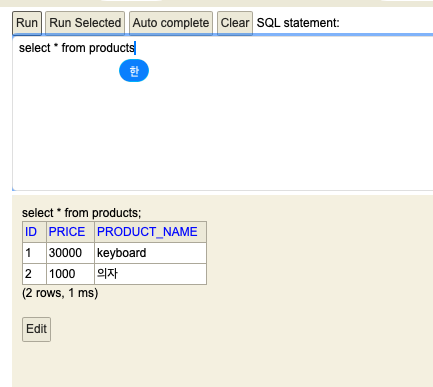

# Week05 

## Web의 동작 원리

### Web의 등장
- 인터넷의 발전과 함께 정보를 쉽게 공유하기 위해 Web이 등장하였다.
- 웹 브라우저를 통해 다양한 웹 페이지와 서비스를 사용할 수 있다.

### 클라이언트와 서버
- 클라이언트(Client)는 사용자 요청을 보내는 역할을 한다.
- 서버(Server)는 요청을 처리하고 결과를 응답한다.
- 클라이언트와 서버는 Request / Response 방식으로 통신한다.

### HTTP와 URL
- HTTP는 웹에서 데이터를 주고받기 위한 통신 규약이다.
- URL은 인터넷 상의 자원의 위치를 의미한다.
- 사용자가 URL을 입력하면 HTTP 요청이 서버로 전달된다.

### 쿠키와 세션
- 쿠키는 클라이언트 브라우저에 저장되는 데이터이다.
- 세션은 서버에서 사용자 정보를 관리하는 방식이다.
- 로그인 상태 유지 등에 사용된다.

### IP, Port 그리고 DNS
- IP는 인터넷에서 컴퓨터를 구분하기 위한 주소이다.
- Port는 하나의 서버에서 여러 프로그램을 구분하기 위한 번호이다.
- DNS는 도메인 주소를 IP 주소로 변환해주는 시스템이다.

---

## Spring Boot 프로젝트 생성

### Spring Initializr 사용
- Spring Initializr를 통해 Spring Boot 프로젝트를 생성하였다.
- Gradle 기반 Java 프로젝트로 설정하였다.

### 프로젝트 설정
- Language : Java
- Spring Boot Version : 4.0.6
- Java Version : 17
- Packaging : Jar

### 사용한 Dependency
- Spring Web
    - REST API 및 웹 애플리케이션 개발

- H2 Database
    - 테스트용 인메모리 데이터베이스

- Spring Data JPA
    - 객체 중심 데이터베이스 연동 지원

### Spring Initializr 설정 화면

---

## CRUD API 구현

### CRUD란?
- Create : 데이터 생성
- Read : 데이터 조회
- Update : 데이터 수정s
- Delete : 데이터 삭제

웹 서비스에서 가장 기본이 되는 데이터 처리 기능이다.

---

## 데이터베이스와 모델(Entity)

### Product Entity
- `@Entity`를 사용하여 Product 클래스를 데이터베이스 테이블과 연결하였다.
- `@Id`와 `@GeneratedValue`를 사용해 기본 키를 설정하였다.
- 상품 이름과 가격 정보를 저장하도록 구성하였다.

### Repository
- `JpaRepository`를 상속받아 기본적인 데이터베이스 기능을 사용할 수 있었다.
- 별도의 SQL 없이 CRUD 기능을 구현할 수 있었다.

### Service
- 비즈니스 로직을 처리하는 계층이다.
- Repository를 통해 데이터베이스 작업을 수행하였다.

### Controller
- 클라이언트의 요청을 처리하는 역할을 한다.
- `@GetMapping`, `@PostMapping`, `@PutMapping`, `@DeleteMapping`을 사용하여 API를 구현하였다.

---

## CRUD 기능 구현

### Create
- 상품 데이터를 생성하고 데이터베이스에 저장하였다.

### Read
- ID를 이용해 상품 데이터를 조회하였다.

### Update
- 기존 상품 데이터를 수정하였다.

### Delete
- 특정 상품 데이터를 삭제하였다.

---

## API 테스트

### POST 요청 테스트 1
- Postman을 이용하여 상품 데이터를 생성하였다.
- JSON 형식의 데이터를 Body에 담아 POST 요청을 전송하였다.

---

### POST 요청 테스트 2
- 다른 상품 데이터도 추가로 저장하며 API 동작을 확인하였다.
- HTTP 상태 코드 200 OK를 통해 정상 요청 여부를 확인하였다.

---

### GET 요청 테스트
- GET 요청을 통해 특정 ID의 상품 데이터를 조회하였다.
- 저장된 상품 정보가 JSON 형태로 반환되는 것을 확인하였다.

---

### H2 Database 확인
- H2 Console에서 products 테이블 데이터를 확인하였다.
- Postman으로 저장한 데이터가 실제 데이터베이스에 저장되는 것을 확인할 수 있었다.

---

## 실습 코드 설명

### Product Entity
- 상품 이름과 가격 정보를 저장하는 Entity 클래스 구현

### ProductRepository
- JPA Repository를 이용한 데이터베이스 접근 구현

### ProductService
- CRUD 기능 인터페이스 정의

### ProductServiceImpl
- 실제 CRUD 로직 구현

### ProductController
- REST API 요청 처리 및 CRUD API 구현

---

## 헷갈렸던 점 → 해결

### Postman 사용 방법
- 처음에는 Postman으로 API를 어떻게 테스트해야 하는지 헷갈렸다.
- GET, POST, PUT, DELETE 요청 방식을 직접 실습하면서 API 테스트 방법을 이해할 수 있었다.
- Body에 JSON 데이터를 넣어 요청을 보내는 방법과 응답 데이터를 확인하는 방법을 익힐 수 있었다.

### 강의 버전과 현재 개발 환경 차이
- 강의에서는 Java 11과 Spring Boot 2 버전을 사용하였다.
- 현재 실습 환경에서는 Java 17과 Spring Boot 4 버전을 사용하면서 일부 문법과 패키지 구조 차이가 발생하였다.
- 특히 JPA 관련 패키지가 `javax.persistence`에서 `jakarta.persistence`로 변경되었다.
- 또한 Entity 클래스의 기본 생성자 관련 경고도 최신 환경에서 더 엄격하게 확인할 수 있었다.

### javax.persistence 오류
- 강의 코드와 동일하게 `javax.persistence`를 사용했지만 Entity 관련 오류가 발생하였다.
- Spring Boot 최신 버전에서는 `jakarta.persistence`를 사용해야 한다는 점을 확인하고 수정하여 해결하였다.

### 기본 생성자 필요 이유
- JPA는 데이터베이스 데이터를 객체로 생성할 때 기본 생성자를 사용한다.
- 따라서 Entity 클래스에는 parameter가 없는 기본 생성자가 필요하며, public 또는 protected 접근 제어자를 사용해야 한다는 점을 알게 되었다.

---

