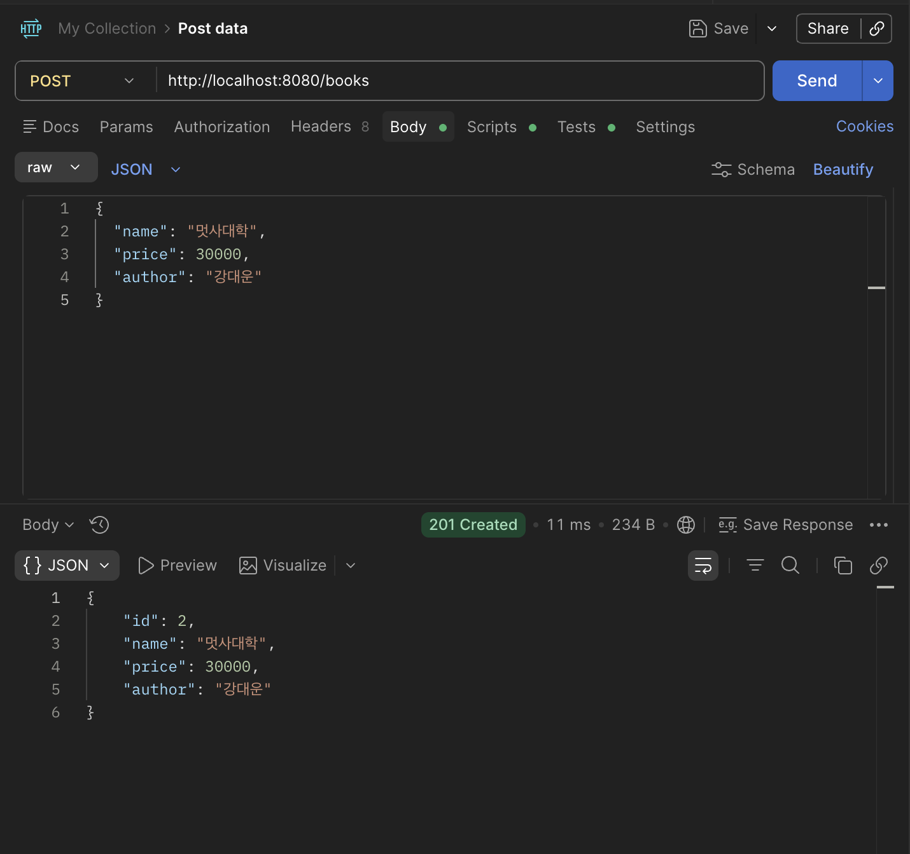

#  Books CRUD API

Spring Boot와 Spring Data JPA를 활용하여 도서 정보를 생성(Create), 조회(Read), 수정(Update), 삭제(Delete)할 수 있는 REST API 프로젝트입니다.

## 1. 프로젝트 소개

이 프로젝트는 도서 정보를 관리하는 기본 CRUD API를 구현한 예제입니다.

사용자는 책 정보를 등록하고, 등록된 책 목록을 조회하고, 특정 책을 조회하거나 수정 및 삭제할 수 있습니다.


## 2. 프로젝트 구조 

```text
src
├── controller
│   └── BookController
├── service
│   └── BookService
├── repository
│   └── BookRepository
├── entity
│   └── Book
└── BooksApiApplication
```

### 계층 구조

| 계층 | 역할 |
| --- | --- |
| Controller | HTTP 요청 처리 |
| Service | 비즈니스 로직 수행 |
| Repository | 데이터베이스 접근 |
| Entity | 데이터베이스 테이블과 매핑 |

프로젝트는 Controller, Service, Repository, Entity로 계층을 분리했습니다.

Controller는 HTTP 요청을 받고, Service는 실제 로직을 처리합니다. Repository는 데이터베이스에 접근하고, Entity는 데이터베이스 테이블과 매핑됩니다.

## 3. API 설명 

| Method | URL | 설명 |
| --- | --- | --- |
| POST | `/books` | 책 등록 |
| GET | `/books` | 전체 조회 |
| GET | `/books/{id}` | 단건 조회 |
| PUT | `/books/{id}` | 수정 |
| DELETE | `/books/{id}` | 삭제 |

CRUD 기능을 모두 REST API 형태로 구현했습니다.

## 4. 실행 흐름 

```text
Postman
↓
BookController
↓
BookService
↓
BookRepository
↓
H2 Database
↓
Response(JSON)
```

Postman에서 요청을 보내면 `BookController`가 요청을 받습니다.

이후 `BookService`에서 비즈니스 로직을 처리하고, `BookRepository`를 통해 H2 Database에 접근합니다.

마지막으로 처리 결과를 JSON 형태로 응답합니다.

## 5. 코드 설명 

### BookController

- `@RestController`를 이용하여 REST API 구현
- `@RequestMapping("/books")`으로 공통 URL 지정
- CRUD 요청 처리

```java
@RestController
@RequiredArgsConstructor
@RequestMapping("/books")
public class BookController {

    private final BookService bookService;
}
```

`BookController`는 클라이언트 요청을 받는 계층입니다.

예를 들어 `POST /books` 요청이 들어오면 책 등록 메서드가 실행되고, 실제 저장 로직은 Service로 넘겨 처리합니다.

### BookService

- 실제 CRUD 로직 수행
- 존재하지 않는 id에 대한 예외 처리
- Controller와 Repository 사이에서 중간 역할 수행

```java
@Service
@RequiredArgsConstructor
@Transactional(readOnly = true)
public class BookService {

    private final BookRepository bookRepository;
}
```

`BookService`는 실제 비즈니스 로직을 담당합니다.

책 등록, 조회, 수정, 삭제 기능을 처리하고, 존재하지 않는 책을 요청했을 때 `404 Not Found`가 반환되도록 예외 처리도 담당합니다.

### BookRepository

`JpaRepository`를 상속하여 CRUD 기능을 자동으로 제공합니다.

```java
public interface BookRepository extends JpaRepository<Book, Long> {
}
```

자동으로 제공되는 주요 메서드는 다음과 같습니다.

- `save()`
- `findAll()`
- `findById()`
- `delete()`

`BookRepository`는 데이터베이스 접근을 담당합니다.

`JpaRepository`를 상속했기 때문에 SQL을 직접 작성하지 않아도 기본 CRUD 기능을 사용할 수 있습니다.

### Book Entity

Book 정보를 저장하는 엔티티입니다.

```java
@Entity
@Getter
@Setter
@Builder
@NoArgsConstructor
@AllArgsConstructor
public class Book {

    @Id
    @GeneratedValue(strategy = GenerationType.IDENTITY)
    private Long id;

    private String name;
    private Integer price;
    private String author;
}
```

Book Entity의 필드는 다음과 같습니다.

- `id`
- `name`
- `price`
- `author`

`Book` 엔티티는 데이터베이스 테이블과 매핑되는 클래스입니다.

`id`는 기본 키이고 자동 증가됩니다. `name`, `price`, `author`는 책 정보를 저장하는 필드입니다.

### 예외 처리

```java
private Book findBook(Long id) {
    return bookRepository.findById(id)
            .orElseThrow(() -> new ResponseStatusException(
                    HttpStatus.NOT_FOUND,
                    "Book not found. id=" + id
            ));
}
```

존재하지 않는 id로 조회, 수정, 삭제를 요청하면 `404 Not Found`를 반환하도록 구현했습니다.

이 로직은 `findBook()` 메서드로 분리해서 중복을 줄였습니다.

## 6. Postman 결과

Postman을 이용해 각 API가 정상적으로 동작하는지 확인할 수 있습니다.



- POST `/books`
- GET `/books`
- GET `/books/{id}`
- PUT `/books/{id}`
- DELETE `/books/{id}`

## 7. 배운 점 

- REST API의 CRUD 구현 방법을 학습했습니다.
- Controller-Service-Repository 계층 구조를 이해했습니다.
- Spring Data JPA를 이용하여 SQL 없이 CRUD를 구현했습니다.
- Postman을 이용한 API 테스트 방법을 익혔습니다.
- 존재하지 않는 데이터에 대해 `404 Not Found`를 반환하는 예외 처리 방법을 익혔습니다.
