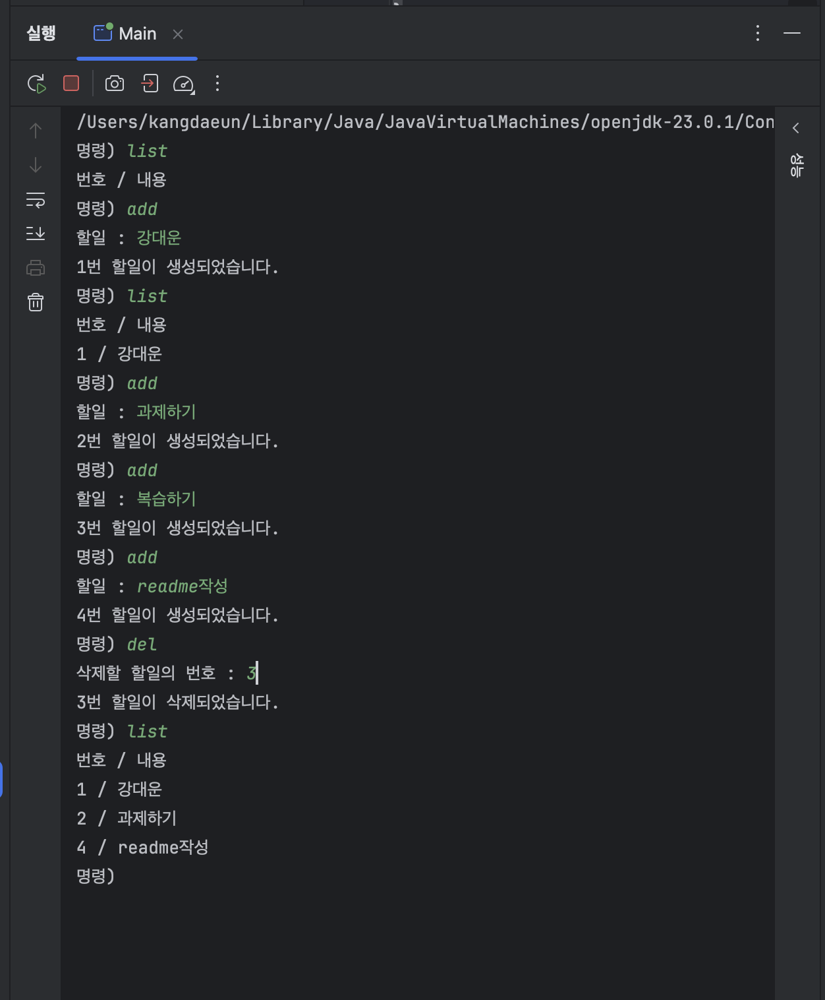

# Todo 관리 서비스

Java로 구현한 콘솔 기반 **할 일 관리 서비스**입니다.

사용자가 명령어를 입력하여 할 일을 추가, 조회, 수정, 삭제할 수 있도록 구현했습니다.

이번 실습에서는 CRUD의 기본 동작을 직접 구현하고, 하나의 클래스에 모여 있던 기능을 역할에 따라 여러 클래스로 분리하는 과정을 학습했습니다.

---

## 1. 프로젝트 소개

콘솔에서 다음과 같은 명령어를 입력하여 할 일을 관리할 수 있습니다.

| 명령어 | 기능 |
| --- | --- |
| `add` | 새로운 할 일 추가 |
| `list` | 등록된 할 일 전체 조회 |
| `modify` | 기존 할 일 수정 |
| `del` | 할 일 삭제 |
| `exit` | 프로그램 종료 |

CRUD와의 관계는 다음과 같습니다.

- Create → `add`
- Read → `list`
- Update → `modify`
- Delete → `del`

---

## 2. 프로젝트 구조

```text
src/main/java/com/ll
├── Main.java
├── App.java
├── Todo.java
├── TodoController.java
└── SystemController.java
```

### 클래스 역할

| 클래스 | 역할 |
| --- | --- |
| `Main` | 프로그램 시작 |
| `App` | 명령어 입력 및 Controller 호출 |
| `Todo` | 할 일의 번호와 내용을 저장하는 객체 |
| `TodoController` | Todo의 CRUD 기능 처리 |
| `SystemController` | 프로그램 종료와 같은 시스템 기능 처리 |

---

## 3. 프로그램 실행 흐름

```text
사용자
  ↓
명령어 입력
  ↓
App
  ↓
┌─────────────────────────┐
│                         │
TodoController     SystemController
│                         │
CRUD 처리                 종료 처리
│
ArrayList<Todo>
```

`App`은 사용자의 명령어를 입력받은 뒤 직접 모든 로직을 처리하지 않고, 명령에 맞는 Controller에게 작업을 전달합니다.

Todo와 관련된 기능은 `TodoController`, 시스템과 관련된 기능은 `SystemController`가 담당하도록 역할을 분리했습니다.

---

## 4. 주요 구현

### Todo 객체

할 일의 번호와 내용을 하나의 객체로 관리했습니다.

```java
public class Todo {
    private long id;
    private String content;
}
```

서로 관련된 `id`와 `content`를 하나의 `Todo` 객체로 묶어 관리합니다.

### ArrayList를 이용한 저장

사용자가 몇 개의 할 일을 등록할지 미리 알 수 없기 때문에 배열 대신 `ArrayList<Todo>`를 사용했습니다.

```java
private ArrayList<Todo> todos;
```

프로그램이 실행되는 동안 생성된 Todo 객체를 리스트에 저장합니다.

### ID 관리

할 일이 삭제되어도 기존 ID를 다시 사용하지 않도록 마지막으로 생성된 ID를 별도로 관리했습니다.

예를 들어,

```text
1번 생성
2번 생성
3번 생성
3번 삭제
4번 생성
```

과 같이 동작합니다.

---

## 5. 실행 결과

### Todo 추가 및 조회

`add` 명령을 통해 새로운 Todo를 생성하고, `list` 명령을 통해 등록된 Todo를 조회할 수 있습니다.

### Todo 삭제

`del` 명령으로 원하는 번호의 Todo를 삭제할 수 있습니다.

삭제한 번호는 다시 사용하지 않고 새로운 Todo에는 다음 ID가 부여됩니다.

### 실제 실행 화면



---

## 6. 핵심 코드

### Todo 추가

```java
public void add() {
    long id = ++todosLastId;

    System.out.print("할일 : ");
    String content = scanner.nextLine().trim();

    Todo todo = new Todo(id, content);
    todos.add(todo);

    System.out.printf("%d번 할일이 생성되었습니다.%n", id);
}
```

### Todo 삭제

```java
boolean removed = todos.removeIf(
        todo -> todo.getId() == id
);
```

`removeIf()`를 이용하여 입력받은 ID와 일치하는 Todo를 리스트에서 삭제했습니다.

### Todo 수정

```java
Todo foundTodo = todos.stream()
        .filter(todo -> todo.getId() == id)
        .findFirst()
        .orElse(null);
```

Stream의 `filter()`를 이용해 수정할 Todo를 찾고, 존재하는 경우 내용을 변경하도록 구현했습니다.

---

## 7. 배운 점

이번 실습을 통해 다음 내용을 학습했습니다.

- CRUD의 기본 개념
- `Scanner`를 이용한 콘솔 입력
- 객체를 이용한 데이터 관리
- `ArrayList`를 이용한 여러 객체 관리
- `removeIf()`를 이용한 데이터 삭제
- Stream을 이용한 데이터 검색
- 클래스와 메서드의 역할 분리
- Controller의 기본적인 역할

처음에는 하나의 클래스에서 모든 기능을 구현할 수 있지만 기능이 많아질수록 유지보수가 어려워집니다.

`App`, `TodoController`, `SystemController`로 역할을 분리하면서 **하나의 클래스는 하나의 역할에 집중하도록 구성하는 이유**를 이해할 수 있었습니다.

---

## 8. 한 줄 정리

> Java로 Todo CRUD를 직접 구현하고, 기능별 Controller 분리를 통해 객체지향적인 역할 분리를 연습한 프로젝트입니다.