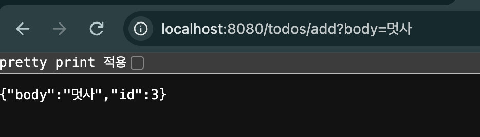
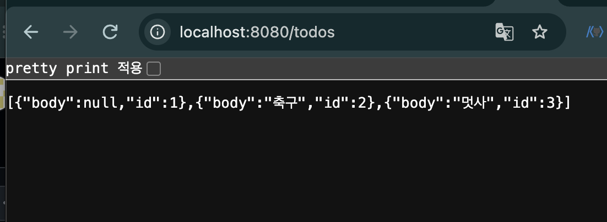
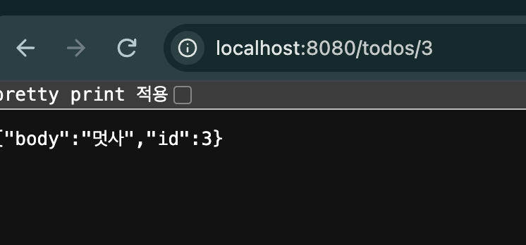
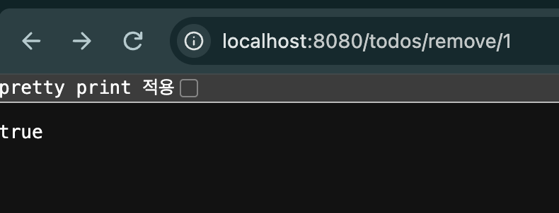
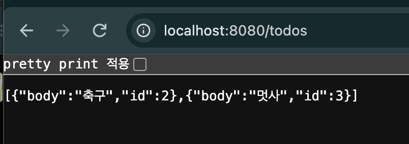
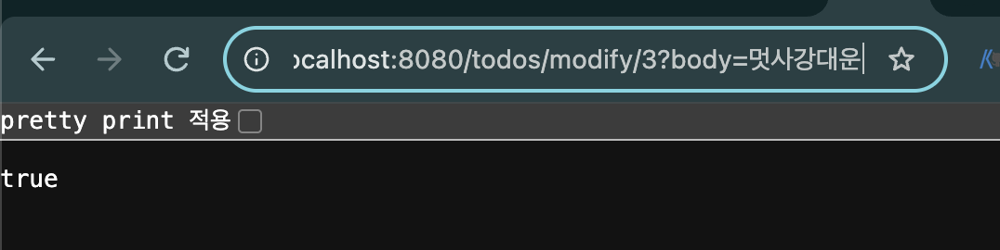
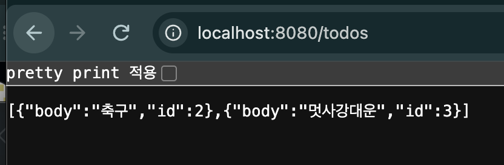
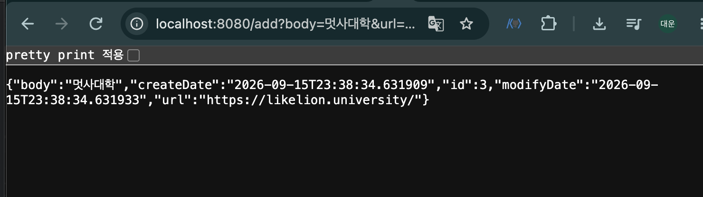
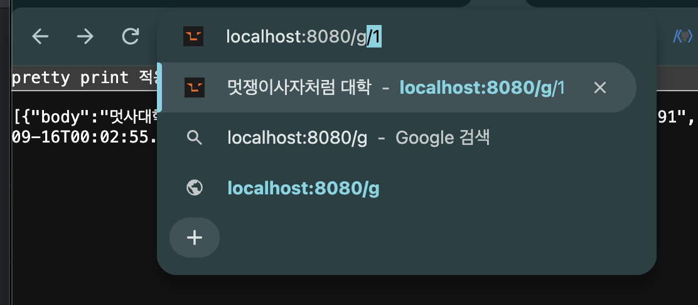

# Week08 - Spring Boot 기초 & Todo CRUD & URL 단축 서비스

이번 주에는 Spring Boot의 기본적인 HTTP 요청/응답 구조를 학습하고,  
Todo CRUD와 URL 단축 서비스를 직접 실행하며 웹 요청이 Controller까지 전달되는 흐름을 확인했습니다.

---

## 1. demo01 - Spring Boot 기초

### Spring Boot

Spring Boot는 웹 애플리케이션을 만들기 위한 프레임워크입니다.

우리는 Controller와 같은 클래스를 작성하고,  
Spring이 해당 클래스와 메서드의 역할을 알 수 있도록 어노테이션을 사용합니다.

```java
@Controller
public class HomeController {

    @GetMapping("/a")
    @ResponseBody
    public String hello() {
        return "hello";
    }
}
```

브라우저에서 다음 주소로 접속하면:

```text
http://localhost:8080/a
```

브라우저가 서버로 GET 요청을 보내고  
`@GetMapping("/a")`가 연결된 메서드가 실행됩니다.

---

## 2. HTTP Request / Response

브라우저는 클라이언트이고 Spring Boot 애플리케이션은 서버입니다.

```text
Browser
   ↓ HTTP Request
Spring Boot
   ↓
Controller
   ↓
Method 실행
   ↓
HTTP Response
   ↓
Browser
```

브라우저 주소창에 URL을 입력하고 엔터를 누르면 기본적으로 GET 요청이 발생합니다.

예시:

```text
http://localhost:8080/a
```

```java
@GetMapping("/a")
```

위 URL로 요청이 들어오면 해당 메서드가 실행됩니다.

---

## 3. @ResponseBody

`@ResponseBody`는 메서드의 반환값을  
HTTP Response Body에 직접 넣어 응답하도록 합니다.

```java
@GetMapping("/a")
@ResponseBody
public String hello() {
    return "hello";
}
```

개념적인 HTTP 응답은 다음과 같습니다.

```text
HTTP/1.1 200 OK

hello
```

`hello`가 HTTP Response Body에 들어갑니다.

즉,

```text
메서드 return 값
        ↓
@ResponseBody
        ↓
HTTP Response Body
        ↓
Browser
```

의 흐름입니다.

---

## 4. Query Parameter

URL을 통해 값을 전달할 수도 있습니다.

```text
http://localhost:8080/a?age=23&name=daeun
```

구조는 다음과 같습니다.

```text
?     → Query Parameter 시작
=     → 이름과 값 연결
&     → 여러 Parameter 구분
```

예를 들어:

```java
@GetMapping("/a")
@ResponseBody
public String a(int age, String name) {
    return name + "의 나이는 " + age;
}
```

요청:

```text
/a?age=23&name=daeun
```

결과적으로:

```text
age  = 23
name = "daeun"
```

값이 메서드의 파라미터로 전달됩니다.

---

## 5. JSON과 Jackson

Java 객체를 HTTP를 통해 클라이언트에 전달할 때  
객체를 그대로 보내는 것이 아니라 텍스트 형태로 표현해야 합니다.

대표적인 데이터 표현 형식으로 XML과 JSON이 있습니다.

### XML

```xml
<person>
    <name>Paul</name>
    <age>22</age>
</person>
```

### JSON

```json
{
  "name": "Paul",
  "age": 22
}
```

현재 웹 API에서는 JSON을 많이 사용합니다.

Spring Boot에서는 Jackson을 통해 Java 객체를 JSON 형태로 변환할 수 있습니다.

```java
@ResponseBody
public Person person() {
    return new Person("Paul", 22);
}
```

Java 객체:

```text
Person
- name = Paul
- age = 22
```

응답:

```json
{
  "name": "Paul",
  "age": 22
}
```

즉,

```text
Java Object
    ↓
Jackson
    ↓
JSON
    ↓
HTTP Response Body
```

형태로 전달됩니다.

> Query Parameter의 `"23" → int 23`과 같은 변환은 Jackson이 아니라  
> Spring MVC의 타입 변환 기능이 처리합니다.

---

## 6. Lombok

Lombok은 반복적으로 작성해야 하는 Java 코드를  
어노테이션을 통해 자동으로 생성해주는 라이브러리입니다.

예를 들어:

```java
@Getter
@Setter
@Builder
public class Todo {
    private long id;
    private String body;
}
```

### 주요 Lombok 어노테이션

| Annotation | 역할 |
| --- | --- |
| `@Getter` | Getter 생성 |
| `@Setter` | Setter 생성 |
| `@ToString` | `toString()` 생성 |
| `@AllArgsConstructor` | 모든 필드를 받는 생성자 생성 |
| `@NoArgsConstructor` | 기본 생성자 생성 |
| `@RequiredArgsConstructor` | 필요한 필드를 받는 생성자 생성 |
| `@Builder` | Builder 패턴으로 객체 생성 |

Builder를 사용하면:

```java
Todo todo = Todo.builder()
        .id(1)
        .body("멋사")
        .build();
```

처럼 객체를 생성할 수 있습니다.

---

## 7. Spring Bean과 DI

Spring이 직접 생성하고 관리하는 객체를 **Bean**이라고 합니다.

```java
@Component
public class ComponentA {
}
```

`@Component`를 붙이면 Spring이 해당 클래스의 객체를 생성하고 관리합니다.

```text
@Component
     ↓
Spring이 객체 생성
     ↓
Bean
```

다른 클래스에서 해당 Bean이 필요하면  
Spring이 객체를 넣어줄 수 있습니다.

이를 **Dependency Injection(DI, 의존성 주입)**이라고 합니다.

### @Autowired

```java
@Controller
public class HomeController {

    @Autowired
    private ComponentA componentA;
}
```

Spring이 관리하고 있는 `ComponentA` Bean을 찾아 주입합니다.

### @RequiredArgsConstructor

```java
@Component
@RequiredArgsConstructor
public class ComponentA {

    private final ComponentB componentB;
}
```

Lombok이 다음과 같은 생성자를 자동으로 만들어줍니다.

```java
public ComponentA(ComponentB componentB) {
    this.componentB = componentB;
}
```

Spring은 이 생성자를 통해 필요한 Bean을 주입합니다.

정리하면:

```text
Bean
= Spring이 생성하고 관리하는 객체

@Component
= Spring Bean으로 등록

DI
= 필요한 객체를 Spring이 넣어주는 것

@RequiredArgsConstructor
= Lombok이 생성자를 만들어줌

실제 Bean 주입
= Spring이 수행
```

---

# demo02 - Todo CRUD

기존 콘솔 기반 Todo 프로그램의 CRUD 기능을  
Spring Boot의 HTTP 요청을 이용하는 형태로 구현했습니다.

## Todo 구조

```java
@Getter
@Setter
@Builder
public class Todo {
    private long id;
    private String body;
}
```

Controller에서는 Todo 목록을 메모리에 저장합니다.

```java
private long todosLastId;
private List<Todo> todos;
```

---

## Todo API

| 기능 | 요청 |
| --- | --- |
| 전체 조회 | `GET /todos` |
| 단건 조회 | `GET /todos/{id}` |
| 추가 | `GET /todos/add?body={내용}` |
| 삭제 | `GET /todos/remove/{id}` |
| 수정 | `GET /todos/modify/{id}?body={내용}` |

이번 실습에서는 기능 학습을 위해 GET 요청을 사용했습니다.  
실제 REST API에서는 일반적으로 데이터 생성에는 POST, 수정에는 PUT/PATCH, 삭제에는 DELETE를 사용합니다.

---

## 1. Todo 추가

요청:

```text
GET /todos/add?body=멋사
```

Todo 객체를 생성한 뒤 리스트에 추가합니다.

```java
Todo todo = Todo.builder()
        .id(++todosLastId)
        .body(body)
        .build();

todos.add(todo);
```

실행 결과:



응답 예시:

```json
{
  "body": "멋사",
  "id": 3
}
```

---

## 2. Todo 전체 조회

요청:

```text
GET /todos
```

Todo 목록 전체를 반환합니다.

```java
@GetMapping("")
public List<Todo> getTodos() {
    return todos;
}
```

실행 결과:



Java의 `List<Todo>`가 JSON 배열 형태로 변환되어 응답되는 것을 확인했습니다.

---

## 3. PathVariable을 이용한 단건 조회

요청:

```text
GET /todos/3
```

Controller:

```java
@GetMapping("/{id}")
public Todo getTodo(
        @PathVariable long id
) {
    return todos
            .stream()
            .filter(todo -> todo.getId() == id)
            .findFirst()
            .orElse(null);
}
```

URL의 `3`이라는 값을 `@PathVariable`을 이용해 `id`에 전달합니다.

실행 결과:



```text
/todos/3
    ↓
@PathVariable
    ↓
id = 3
    ↓
Todo 조회
```

---

## 4. Todo 삭제

요청:

```text
GET /todos/remove/1
```

구현:

```java
boolean removed =
        todos.removeIf(todo -> todo.getId() == id);

return removed;
```

삭제에 성공하면 `true`를 반환합니다.

실행 결과:



### 삭제 후 조회

다시:

```text
GET /todos
```

요청을 보내 1번 Todo가 삭제된 것을 확인했습니다.



---

## 5. Todo 수정

요청:

```text
GET /todos/modify/3?body=멋사강대운
```

먼저 id가 일치하는 Todo를 찾습니다.

```java
Todo todo = todos
        .stream()
        .filter(_todo -> _todo.getId() == id)
        .findFirst()
        .orElse(null);
```

Todo가 존재하면:

```java
todo.setBody(body);
```

를 통해 내용을 수정합니다.

실행 결과:



### 수정 후 조회

다시:

```text
GET /todos
```

요청을 보내 3번 Todo의 내용이 변경된 것을 확인했습니다.



---

# demo03 - URL 단축 서비스

Todo CRUD에서 학습한 HTTP 요청 처리 방식을 이용해  
간단한 URL 단축 서비스를 구현했습니다.

URL 하나의 정보를 `Surl` 객체에 저장합니다.

## Surl

```java
public class Surl {
    private long id;
    private LocalDateTime createDate;
    private LocalDateTime modifyDate;
    private String body;
    private String url;
    private long count;
}
```

각 필드는 다음 정보를 의미합니다.

```text
id
→ URL 번호

body
→ URL에 대한 설명

url
→ 실제 이동할 원본 URL

createDate
→ 생성 시간

modifyDate
→ 수정 시간

count
→ URL 이동 횟수
```

즉, `Surl` 객체는 **원본 URL 하나를 관리하기 위한 데이터 객체**입니다.

---

## 1. URL 등록

요청:

```text
GET /add?body=멋사대학&url=https://likelion.university/
```

Controller에서는 새로운 `Surl` 객체를 생성합니다.

```java
Surl surl = Surl.builder()
        .id(++surlsLastId)
        .body(body)
        .url(url)
        .build();

surls.add(surl);
```

실행 결과:



응답에는 생성된 Surl의 정보가 JSON 형태로 표시됩니다.

```json
{
  "id": 3,
  "body": "멋사대학",
  "url": "https://likelion.university/"
}
```

---

## 2. 저장된 URL 조회 및 Redirect

요청:

```text
GET /g/1
```

Controller에서는 id가 1인 Surl을 찾습니다.

```java
Surl surl = surls
        .stream()
        .filter(_surl -> _surl.getId() == id)
        .findFirst()
        .orElse(null);
```

URL이 존재하면 접근 횟수를 증가시킵니다.

```java
surl.increaseCount();
```

그리고:

```java
return "redirect:" + surl.getUrl();
```

를 통해 저장된 원본 URL로 이동합니다.

흐름:

```text
GET /g/1
    ↓
id = 1인 Surl 조회
    ↓
count 증가
    ↓
저장된 원본 URL 확인
    ↓
redirect
    ↓
원본 사이트 이동
```

실행 결과:



---

# 프로젝트 구조

```text
week08/
├── README.md
├── demo01/
│   └── Spring Boot 기초 실습
│
├── demo02/
│   └── Todo CRUD
│
├── demo03/
│   └── URL 단축 서비스
│
└── images/
    ├── add.png
    ├── get.png
    ├── path.png
    ├── remove.png
    ├── get_1remove.png
    ├── modify.png
    ├── get_modify.png
    ├── demo03_add.png
    └── redirect.png
```

---

# 이번 주 학습 정리

이번 학습에서는 Spring Boot를 이용해 브라우저의 요청이  
Java 메서드까지 전달되고 다시 응답되는 전체 흐름을 학습했습니다.

```text
Browser
   ↓
HTTP Request
   ↓
@GetMapping
   ↓
Controller Method
   ↓
Return Value
   ↓
@ResponseBody / Jackson
   ↓
HTTP Response
   ↓
Browser
```

특히 다음 개념을 실습을 통해 이해했습니다.

- Spring Boot와 Controller의 역할
- `@Controller`
- `@RestController`
- `@GetMapping`
- `@ResponseBody`
- HTTP Request / Response
- Query Parameter
- `@PathVariable`
- JSON
- Jackson
- Lombok
- Builder Pattern
- Spring Bean
- `@Component`
- Dependency Injection
- `@Autowired`
- `@RequiredArgsConstructor`
- Todo CRUD
- URL 저장 및 Redirect

기존 콘솔 기반 프로그램에서 사용했던 CRUD 개념이  
웹 환경에서는 HTTP 요청을 통해 Controller의 메서드를 호출하는 형태로 확장된다는 점을 확인했습니다.
